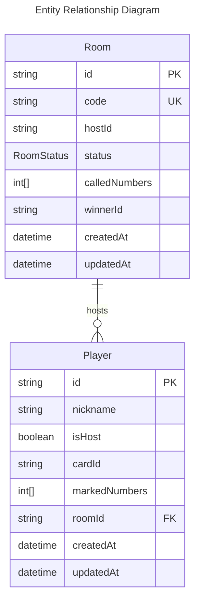

# Game Lô Tô Architecture

## Database Schema

### Room Schema

```
Room {
  id            String     @id @default(cuid())
  code          String     @unique
  hostId        String
  players       Player[]
  status        RoomStatus
  calledNumbers Int[]
  winnerId      String?
  createdAt     DateTime   @default(now())
  updatedAt     DateTime   @updatedAt
}
```

### Player Schema

```
Player {
  id            String   @id @default(cuid())
  nickname      String
  isHost        Boolean  @default(false)
  cardId        String
  markedNumbers Int[]
  roomId        String
  room          Room     @relation(fields: [roomId], references: [id])
  createdAt     DateTime @default(now())
  updatedAt     DateTime @updatedAt
}
```

### RoomStatus Enum

```
enum RoomStatus {
  waiting
  selecting
  playing
  ended
}
```

### LoToCard Interface

```
interface LoToCard {
  id: string;
  backgroundColor?: string;
  grid: (number | null)[][];
}
```

## Entity Relationship Diagram



## Key Relationships and Game Logic

- A Room can have multiple Players (one-to-many relationship)
- Each Player belongs to exactly one Room
- Players are assigned a LoToCard (referenced by cardId) which contains a grid of numbers
- The Room entity tracks game state with:
  - status (waiting, selecting, playing, ended)
  - calledNumbers (numbers that have been called during the game)
  - winnerId (optional, identifies the winner when the game ends)
- Players track their progress with markedNumbers (numbers they've marked on their card)
- The hostId in Room identifies which player is hosting the game
- The game uses a set of predefined card templates with specific number arrangements
